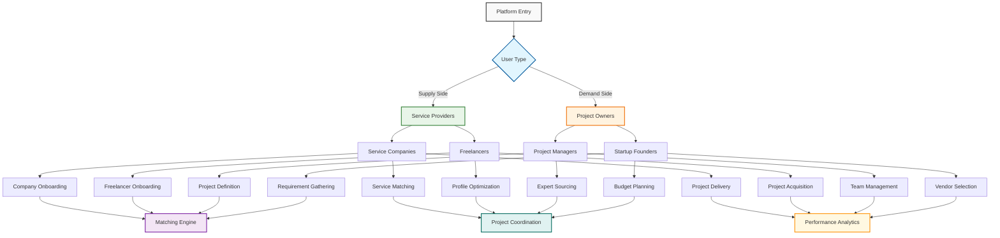

# Brainstorming Status of Agent Module Architecture: Supply Side vs Demand Side User Journey

> **Purpose**: Central architectural document organizing agent modules by supply/demand sides and user journey stages. Each module represents specialized agents supporting specific user types through their complete platform experience.

## Agent Workflow Patterns

### Available Workflow Types

**Hierarchical Workflow**
- **Structure**: Central orchestrator coordinates specialist agents
- **Pattern**: Supervisor-Worker model with intelligent routing
- **Communication**: Top-down delegation with result aggregation
- **Best For**: Complex tasks requiring specialized expertise and coordination

**Sequential Workflow**
- **Structure**: Agents work in ordered sequence with context sharing
- **Pattern**: Task-driven pipeline with handoffs between stages
- **Communication**: Linear progression with accumulated context
- **Best For**: Multi-stage processes where each step builds on previous results

**Collaborative Workflow**
- **Structure**: Multiple agents work together on shared tasks
- **Pattern**: Consensus building and peer review processes
- **Communication**: Multi-directional dialogue and agreement protocols
- **Best For**: Decision-making requiring multiple perspectives and validation

**Graph-based Workflow**
- **Structure**: Agents connected in complex dependency networks
- **Pattern**: Node-based execution with conditional paths
- **Communication**: Dynamic routing based on intermediate results
- **Best For**: Complex workflows with multiple decision points and dependencies

**ReAct Workflow**
- **Structure**: Reasoning and acting loops with iterative tool usage
- **Pattern**: Think-Act-Observe cycles with environmental feedback
- **Communication**: Agent-environment interaction with self-reflection
- **Best For**: Tasks requiring iterative problem-solving with external tools

**Tree of Thoughts Workflow**
- **Structure**: Multiple reasoning paths explored simultaneously
- **Pattern**: Parallel exploration with path evaluation and selection
- **Communication**: Multi-path analysis with convergence to best solution
- **Best For**: Complex problems benefiting from multiple solution approaches

---

## System Architecture Overview

---

## Supply Side: Service Providers

### Service Companies User Journey

#### Onboarding Stage: Company Profiling Module
**Purpose**: Automated company analysis and platform registration

**User Journey Context**: First-time company registration - website analysis to understand services
**Workflow Pattern**: Sequential Workflow
**Orchestrator**: None (task-driven sequence)

**Agent Collection**:
- **Website Content Scraper**
  - **Role**: Extract company information from websites
  - **Tools**: ScrapeWebsiteTool
  - **Instructions**: Focus on services, mission, about section, contact information

- **Data Enrichment Researcher**
  - **Role**: Fill information gaps through web research
  - **Tools**: SerperDevTool
  - **Instructions**: Identify missing critical information and verify facts

- **Company Profile Synthesizer**
  - **Role**: Create structured company profiles from raw data
  - **Tools**: None (AI-powered analysis)
  - **Instructions**: Transform data into clean JSON with company_name, services, location, contact_info, summary

**Business Value**: Automated company onboarding, service provider profiling, competitive analysis

---

#### Matching Stage: Service Portfolio Optimization Module
**Purpose**: Optimize company service offerings for better project matching

**User Journey Context**: Post-onboarding - helping companies present their services effectively
**Workflow Pattern**: Hierarchical Workflow
**Orchestrator**: Portfolio Strategy Coordinator

**Agent Collection**:
- **Portfolio Strategy Coordinator**
  - **Role**: Orchestrate service portfolio optimization
  - **Tools**: Analytics dashboards, market research APIs
  - **Instructions**: Coordinate analysis of service positioning and market opportunities

- **Service Gap Analyzer**
  - **Role**: Identify missing services in company portfolio
  - **Tools**: Market analysis tools, competitor research APIs
  - **Instructions**: Compare company services against market demand and competitor offerings

- **Pricing Strategy Optimizer**
  - **Role**: Recommend optimal pricing for company services
  - **Tools**: Market data APIs, pricing analysis tools
  - **Instructions**: Analyze market rates and suggest competitive pricing strategies

- **Portfolio Presenter**
  - **Role**: Create compelling service presentations
  - **Tools**: None (AI-powered content generation)
  - **Instructions**: Generate professional service descriptions and case studies

**Business Value**: Improved service positioning, competitive pricing, better project matching

---

#### Project Delivery Stage: Company Project Management Module
**Purpose**: Support companies in managing client projects effectively

**User Journey Context**: Active project delivery - helping companies manage ongoing work
**Workflow Pattern**: Graph-based Workflow
**Orchestrator**: Project Delivery Coordinator

**Agent Collection**:
- **Project Delivery Coordinator**
  - **Role**: Orchestrate project delivery workflows
  - **Tools**: Project management APIs, scheduling systems
  - **Instructions**: Manage project timelines, resource allocation, and client communication

- **Resource Allocation Optimizer**
  - **Role**: Optimize team assignments and resource usage
  - **Tools**: Resource planning tools, capacity analysis
  - **Instructions**: Assign optimal team members to projects based on skills and availability

- **Client Communication Manager**
  - **Role**: Manage client communications and updates
  - **Tools**: Communication platforms, notification systems
  - **Instructions**: Provide regular project updates and manage client expectations

- **Quality Delivery Assurance**
  - **Role**: Ensure delivery quality meets client expectations
  - **Tools**: Quality assessment frameworks, review systems
  - **Instructions**: Monitor deliverable quality and suggest improvements

**Business Value**: Improved project delivery, client satisfaction, operational efficiency

---

### Freelancers User Journey

#### Onboarding Stage: CV Processing Module
**Purpose**: Comprehensive freelancer profile generation from CV analysis

**User Journey Context**: First-time freelancer registration - CV upload and profile creation
**Workflow Pattern**: Hierarchical Workflow
**Orchestrator**: Freelancer Profile Manager

**Agent Collection**:
- **Freelancer Profile Manager**
  - **Role**: Central orchestrator for CV processing workflow
  - **Tools**: prepare_cv_file_for_processing
  - **Instructions**: Coordinate complete CV processing from stored data to final profile

- **CV Content Validator**
  - **Role**: Input validation guardrail
  - **Tools**: InputGuardrail functions
  - **Instructions**: Validate stored CV identifiers and content relevance

- **CV Parser Agent**
  - **Role**: Document extraction specialist
  - **Tools**: extract_cv_text_with_responses_api, OpenAI Files API
  - **Instructions**: Extract personal info, work experience, education, skills, certifications

- **Profile Enrichment Agent**
  - **Role**: Professional summary enhancement
  - **Tools**: None (AI-powered analysis)
  - **Instructions**: Create professional summaries and highlight achievements

- **Skills Extraction Agent**
  - **Role**: Technical and soft skill categorization
  - **Tools**: None (AI-powered analysis)
  - **Instructions**: Categorize skills, assess proficiency levels, map to industry standards

- **Gap Analysis Agent**
  - **Role**: Profile completeness assessment
  - **Tools**: None (AI-powered analysis)
  - **Instructions**: Identify missing information and provide improvement recommendations

**Business Value**: Automated freelancer onboarding, standardized skill assessment, profile quality improvement
**Current Status**: 90.6% accuracy on personal information extraction, complete file upload system

---

#### Profile Optimization Stage: Freelancer Development Module
**Purpose**: Continuous freelancer profile improvement and skill development

**User Journey Context**: Post-onboarding - helping freelancers improve their profiles and skills
**Workflow Pattern**: ReAct Workflow
**Orchestrator**: Freelancer Development Coordinator

**Agent Collection**:
- **Freelancer Development Coordinator**
  - **Role**: Orchestrate freelancer development initiatives
  - **Tools**: Learning management systems, progress tracking
  - **Instructions**: Coordinate skill assessment and development planning

- **Market Demand Analyzer**
  - **Role**: Analyze current market demand for freelancer skills
  - **Tools**: Job market APIs, trend analysis tools
  - **Instructions**: Identify high-demand skills and emerging market opportunities

- **Skill Gap Identifier**
  - **Role**: Identify skill gaps in freelancer profiles
  - **Tools**: Skill assessment tools, market comparison
  - **Instructions**: Compare current skills with market demands and career goals

- **Learning Path Creator**
  - **Role**: Create personalized learning recommendations
  - **Tools**: Course databases, learning pathway algorithms
  - **Instructions**: Design customized learning paths based on skill gaps and goals

- **Portfolio Optimizer**
  - **Role**: Optimize freelancer portfolios for better visibility
  - **Tools**: Portfolio analysis tools, presentation frameworks
  - **Instructions**: Suggest portfolio improvements to increase project acquisition

**Business Value**: Continuous skill development, market alignment, improved earning potential

---

#### Project Acquisition Stage: Freelancer Bidding Module
**Purpose**: Help freelancers identify and win relevant projects

**User Journey Context**: Active job search - finding and applying for suitable projects
**Workflow Pattern**: Tree of Thoughts Workflow
**Orchestrator**: Bidding Strategy Coordinator

**Agent Collection**:
- **Bidding Strategy Coordinator**
  - **Role**: Orchestrate bidding strategy across multiple approaches
  - **Tools**: Project databases, bidding analytics
  - **Instructions**: Coordinate multiple bidding strategies and optimize success rates

- **Project Compatibility Assessor**
  - **Role**: Evaluate project-freelancer fit
  - **Tools**: Matching algorithms, compatibility scoring
  - **Instructions**: Assess how well freelancer skills match project requirements

- **Competitive Analysis Agent**
  - **Role**: Analyze competition for specific projects
  - **Tools**: Competitor analysis tools, market research
  - **Instructions**: Evaluate other freelancers bidding on projects and suggest differentiation

- **Proposal Generator**
  - **Role**: Create compelling project proposals
  - **Tools**: None (AI-powered content generation)
  - **Instructions**: Generate personalized proposals highlighting relevant experience

- **Pricing Strategy Advisor**
  - **Role**: Recommend optimal bidding prices
  - **Tools**: Market rate analysis, pricing optimization
  - **Instructions**: Suggest competitive yet profitable pricing for proposals

**Business Value**: Higher bid success rates, optimal pricing, reduced time to project acquisition

---

## Demand Side: Project Owners

### Project Managers User Journey

#### Requirement Gathering Stage: Project Submission Module
**Purpose**: Intelligent project requirement gathering and specification creation

**User Journey Context**: Initial project planning - defining project scope and requirements
**Workflow Pattern**: Hierarchical Workflow
**Orchestrator**: Expert Sourcing Supervisor

**Agent Collection**:
- **Expert Sourcing Supervisor**
  - **Role**: Central coordinator with intelligent routing
  - **Tools**: Agent handoff mechanisms
  - **Instructions**: Route requests between specialists based on client needs

- **Expert Sourcing Validator**
  - **Role**: Input validation guardrail
  - **Tools**: InputGuardrail functions
  - **Instructions**: Ensure requests relate to expert sourcing and talent acquisition

- **Project Requirements Assistant**
  - **Role**: Requirements gathering specialist
  - **Tools**: None (conversational interface)
  - **Instructions**: Help articulate comprehensive project descriptions and timelines

- **Project Refinement Specialist**
  - **Role**: Project description optimization
  - **Tools**: None (AI-powered analysis)
  - **Instructions**: Finalize and polish project descriptions for maximum clarity

**Business Value**: Project scope clarification, requirement articulation, standardized project descriptions

---

#### Expert Sourcing Stage: Expert Matching Module
**Purpose**: Intelligent matching between projects and service providers

**User Journey Context**: Finding the right experts - matching projects with qualified providers
**Workflow Pattern**: Graph-based Workflow
**Orchestrator**: Matching Supervisor

**Agent Collection**:
- **Matching Supervisor**
  - **Role**: Orchestrate matching process across multiple criteria
  - **Tools**: Database query tools, scoring algorithms
  - **Instructions**: Coordinate multi-dimensional matching analysis

- **Requirement Analyzer**
  - **Role**: Break down project requirements into matchable criteria
  - **Tools**: NLP analysis tools, requirement parsing
  - **Instructions**: Extract technical skills, experience levels, domain expertise needs

- **Provider Scorer**
  - **Role**: Evaluate provider-project compatibility
  - **Tools**: Scoring algorithms, similarity metrics
  - **Instructions**: Calculate compatibility scores across multiple dimensions

- **Match Validator**
  - **Role**: Quality assurance for match recommendations
  - **Tools**: Validation rules, historical performance data
  - **Instructions**: Verify match quality and filter low-confidence results

- **Recommendation Presenter**
  - **Role**: Create ranked recommendation lists
  - **Tools**: Ranking algorithms, presentation formatters
  - **Instructions**: Generate prioritized lists with explanation rationales

**Business Value**: Automated expert discovery, quality-based matching, reduced time-to-hire

---

#### Team Management Stage: Project Coordination Module
**Purpose**: Manage multi-provider project teams effectively

**User Journey Context**: Active project management - coordinating work across multiple providers
**Workflow Pattern**: Collaborative Workflow
**Orchestrator**: Project Coordination Supervisor

**Agent Collection**:
- **Project Coordination Supervisor**
  - **Role**: Orchestrate project coordination across teams
  - **Tools**: Project management systems, coordination platforms
  - **Instructions**: Manage cross-team communication and deliverable coordination

- **Timeline Coordinator**
  - **Role**: Manage project timelines and dependencies
  - **Tools**: Scheduling systems, dependency tracking
  - **Instructions**: Coordinate work schedules and manage project dependencies

- **Quality Assurance Coordinator**
  - **Role**: Ensure deliverable quality across providers
  - **Tools**: Quality assessment frameworks, review systems
  - **Instructions**: Coordinate quality reviews and ensure consistent standards

- **Risk Assessment Manager**
  - **Role**: Identify and mitigate project risks
  - **Tools**: Risk analysis tools, mitigation frameworks
  - **Instructions**: Monitor project risks and suggest mitigation strategies

- **Stakeholder Communication Hub**
  - **Role**: Manage communication with all project stakeholders
  - **Tools**: Communication platforms, reporting systems
  - **Instructions**: Provide regular updates and manage stakeholder expectations

**Business Value**: Improved project coordination, risk mitigation, stakeholder satisfaction

---

### Startup Founders User Journey

#### Budget Planning Stage: Resource Planning Module
**Purpose**: Help startups plan budgets and resource allocation for projects

**User Journey Context**: Early-stage planning - understanding costs and resource needs
**Workflow Pattern**: Tree of Thoughts Workflow
**Orchestrator**: Resource Planning Coordinator

**Agent Collection**:
- **Resource Planning Coordinator**
  - **Role**: Orchestrate resource planning across multiple scenarios
  - **Tools**: Budget planning tools, resource calculators
  - **Instructions**: Coordinate multiple planning approaches and optimize resource allocation

- **Budget Estimator**
  - **Role**: Estimate project costs and budget requirements
  - **Tools**: Cost estimation models, market rate databases
  - **Instructions**: Provide accurate budget estimates based on project scope

- **Resource Allocation Optimizer**
  - **Role**: Optimize resource allocation across priorities
  - **Tools**: Optimization algorithms, priority frameworks
  - **Instructions**: Balance resource allocation against business priorities

- **ROI Calculator**
  - **Role**: Calculate expected return on investment
  - **Tools**: Financial modeling tools, ROI calculators
  - **Instructions**: Estimate project ROI and business impact

- **Alternative Strategy Generator**
  - **Role**: Generate alternative resource strategies
  - **Tools**: Scenario planning tools, strategy frameworks
  - **Instructions**: Propose alternative approaches for resource constraints

**Business Value**: Accurate budget planning, optimized resource allocation, informed decision making

---

#### Vendor Selection Stage: Vendor Evaluation Module
**Purpose**: Help startups evaluate and select the best service providers

**User Journey Context**: Provider selection - choosing between multiple options
**Workflow Pattern**: Collaborative Workflow
**Orchestrator**: Vendor Evaluation Coordinator

**Agent Collection**:
- **Vendor Evaluation Coordinator**
  - **Role**: Orchestrate vendor evaluation process
  - **Tools**: Evaluation frameworks, scoring systems
  - **Instructions**: Coordinate comprehensive vendor assessments

- **Capability Assessor**
  - **Role**: Assess vendor technical capabilities
  - **Tools**: Technical evaluation tools, skill assessment
  - **Instructions**: Evaluate vendor technical skills and experience

- **Cultural Fit Analyzer**
  - **Role**: Assess vendor-startup cultural alignment
  - **Tools**: Cultural assessment tools, alignment scoring
  - **Instructions**: Evaluate how well vendors align with startup culture

- **Risk Evaluator**
  - **Role**: Assess risks associated with each vendor
  - **Tools**: Risk assessment frameworks, historical data
  - **Instructions**: Identify potential risks and mitigation strategies

- **Contract Negotiation Assistant**
  - **Role**: Support contract negotiations with vendors
  - **Tools**: Contract templates, negotiation frameworks
  - **Instructions**: Assist in contract terms and negotiation strategies

**Business Value**: Better vendor selection, reduced project risks, optimized partnerships

---

## Cross-Journey Modules

### Communication Orchestration Module
**Purpose**: Manage multi-party communication flows across all user types

**User Journey Context**: Continuous engagement - facilitating communication throughout user journeys
**Workflow Pattern**: Hierarchical Workflow
**Orchestrator**: Communication Supervisor

**Agent Collection**:
- **Communication Supervisor**
  - **Role**: Route messages and manage conversation state
  - **Tools**: Message routing systems, state management
  - **Instructions**: Coordinate multi-party communications and maintain context

- **Message Classifier**
  - **Role**: Categorize and prioritize communications
  - **Tools**: Classification algorithms, priority scoring
  - **Instructions**: Analyze message content and assign appropriate categories and urgency

- **Response Generator**
  - **Role**: Create contextual responses and updates
  - **Tools**: Template systems, personalization engines
  - **Instructions**: Generate appropriate responses based on context and recipient

- **Escalation Manager**
  - **Role**: Handle complex situations requiring intervention
  - **Tools**: Escalation rules, notification systems
  - **Instructions**: Identify situations needing human attention and route appropriately

**Business Value**: Streamlined communication, consistent engagement, reduced response times

---

### Performance Analytics Module
**Purpose**: Comprehensive performance analysis across all user journeys

**User Journey Context**: Continuous improvement - analyzing user behavior and platform performance
**Workflow Pattern**: Sequential Workflow
**Orchestrator**: None (data pipeline sequence)

**Agent Collection**:
- **User Journey Analyzer**
  - **Role**: Analyze user behavior across journey stages
  - **Tools**: Analytics platforms, journey mapping tools
  - **Instructions**: Track user progression and identify optimization opportunities

- **Conversion Optimizer**
  - **Role**: Optimize conversion rates across user funnels
  - **Tools**: A/B testing tools, conversion analytics
  - **Instructions**: Identify bottlenecks and suggest improvements

- **Satisfaction Monitor**
  - **Role**: Monitor user satisfaction across journey stages
  - **Tools**: Survey systems, sentiment analysis
  - **Instructions**: Track satisfaction levels and identify pain points

- **Business Intelligence Generator**
  - **Role**: Generate strategic insights from platform data
  - **Tools**: BI platforms, reporting systems
  - **Instructions**: Transform data into actionable business insights

**Business Value**: Data-driven optimization, improved user experience, strategic decision support

---

## Implementation Roadmap by User Journey

### Phase 1: Onboarding Excellence
**Focus**: Perfect the first-touch experience for all user types
1. Company Profiling Module (Service Companies)
2. CV Processing Module (Freelancers)
3. Project Submission Module (Project Managers)
4. Resource Planning Module (Startup Founders)

### Phase 2: Matching & Discovery
**Focus**: Connect the right people with the right opportunities
1. Expert Matching Module
2. Service Portfolio Optimization Module
3. Freelancer Bidding Module
4. Vendor Evaluation Module

### Phase 3: Active Collaboration
**Focus**: Support users through project execution
1. Project Coordination Module
2. Company Project Management Module
3. Communication Orchestration Module

### Phase 4: Continuous Improvement
**Focus**: Help users grow and optimize their platform experience
1. Freelancer Development Module
2. Performance Analytics Module

---

*This document serves as the user journey-focused architectural blueprint for all agent modules. Each module supports specific user types through their complete platform experience, from onboarding to ongoing success.*
